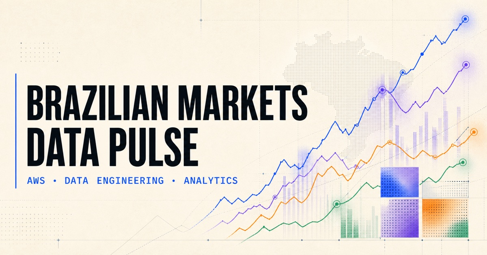
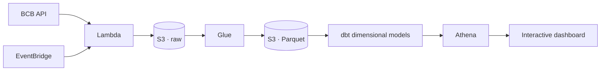

<p align="center">
  
</p>

<p align="center">
  
  
  
  
</p>

<p align="center"><strong>Official Brazilian financial data, collected automatically and prepared for cloud analytics.</strong></p>

<p align="center">
  <a href="https://guivital1.github.io/aws-financial-data-pipeline/"><strong>Explore the live dashboard →</strong></a>
</p>

## Pipeline at a glance

| Source | Ingestion | Processing | Modeling | Analytics | Visualization |
| :---: | :---: | :---: | :---: | :---: | :---: |
| BCB SGS API | EventBridge + Lambda | S3 + Glue + Parquet | dbt · Bronze/Silver/Gold | Athena + SQL | Interactive GitHub Pages |



The repository now includes an executable local analytics warehouse using
DuckDB and dbt. It produces `dim_indicator`, `dim_date`,
`fct_financial_observation` and `mart_real_interest`, with Python and dbt quality
gates before publication.

## Financial signals

| Indicator | Frequency | Purpose |
| --- | --- | --- |
| USD/BRL | Daily | Exchange-rate movement |
| CDI | Daily | Brazilian interbank benchmark |
| Selic | Monthly | Accumulated policy-rate reference |
| IPCA | Monthly | Official consumer inflation |

The analytical layer combines Selic and IPCA to expose an approximate real-interest-rate signal. Every observation retains its original value, source URL, and ingestion timestamp for auditability.

## Current milestone

**Serverless analytics pipeline live on AWS.** A zero-spend budget is active,
weekday ingestion is automated, and Glue remains on demand to keep Spark costs
predictable. The validated dataset contains 674 observations across all four
financial series; Athena queried the curated Parquet layer after scanning only
7.4 KB. See the [deployment evidence](docs/deployment-evidence.md) and the
reproducible [deployment guide](docs/deployment.md).

<details>
  <summary><strong>Run the ingestion locally</strong></summary>

```bash
python -m venv .venv
source .venv/bin/activate
python -m pip install -e .
financial-pipeline
```

Collect selected indicators:

```bash
financial-pipeline --series usd_brl ipca
```

</details>

<details>
  <summary><strong>Build the analytics product</strong></summary>

```bash
python -m pip install -e '.[dev]'
make analytics
```

Or run the same workflow in a disposable container:

```bash
docker compose run --rm analytics
```

The Airflow DAG in `orchestration/dags/` uses the same commands. See the
[production-readiness notes](docs/production-readiness.md) for quality SLAs,
recovery and the AWS mapping.

</details>

<details>
  <summary><strong>Run the quality checks</strong></summary>

```bash
python -m unittest discover -s tests -v
python -m compileall -q src tests glue
```

</details>

## Repository map

```text
src/financial_pipeline/  ingestion, validation and Lambda handler
glue/                    JSONL → partitioned Parquet transformation
sql/                     Athena schema and analytical view
analytics/               dbt staging, dimensions, fact and analytical mart
orchestration/dags/      Airflow DAG for the full data product
template.yaml            cost-controlled AWS SAM infrastructure
docs/                    interactive dashboard, architecture and evidence
scripts/                 dashboard data export
tests/                   deterministic unit tests
```

## Roadmap

- [x] Official data sources and data contract
- [x] Validated Python ingestion client
- [x] Lambda handler, Glue transformation and Athena SQL
- [x] Automated quality checks
- [x] Cost-controlled AWS infrastructure as code
- [x] Controlled S3 + Lambda deployment
- [x] First encrypted ingestion with real BCB data
- [x] Cost-guarded Glue, Data Catalog and Athena infrastructure
- [x] Weekday scheduling and Lambda error monitoring
- [x] Enable the validated weekday schedule
- [x] Interactive public dashboard
- [x] Monitoring and deployment evidence
- [x] Portfolio case study and final visualization
- [x] Bronze, Silver and Gold data architecture
- [x] Dimensional modeling with dbt
- [x] Automated data-quality and freshness gates
- [x] Airflow-compatible orchestration
- [x] Docker and Makefile developer workflow

## Data and responsibility

Data comes from the [Banco Central do Brasil Open Data Portal](https://dadosabertos.bcb.gov.br/). This project is educational and does not provide financial advice.

<p align="center"><sub>Built by <a href="https://github.com/guivital1">Guilherme Vital</a> · Data Engineering · Analytics · Cloud</sub></p>
