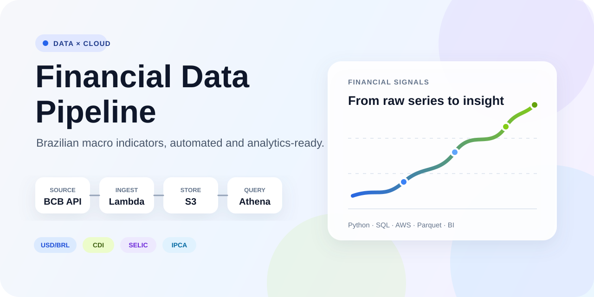
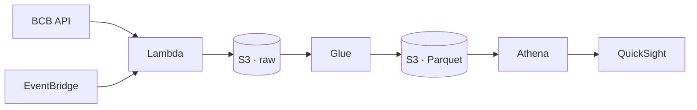

<p align="center">
  
</p>

<p align="center">
  
  
  
  
</p>

<p align="center"><strong>Official Brazilian financial data, collected automatically and prepared for cloud analytics.</strong></p>

## Pipeline at a glance

| Source | Ingestion | Processing | Analytics | Visualization |
| :---: | :---: | :---: | :---: | :---: |
| BCB SGS API | EventBridge + Lambda | S3 + Glue + Parquet | Athena + SQL | QuickSight |



## Financial signals

| Indicator | Frequency | Purpose |
| --- | --- | --- |
| USD/BRL | Daily | Exchange-rate movement |
| CDI | Daily | Brazilian interbank benchmark |
| Selic | Monthly | Accumulated policy-rate reference |
| IPCA | Monthly | Official consumer inflation |

The analytical layer combines Selic and IPCA to expose an approximate real-interest-rate signal. Every observation retains its original value, source URL, and ingestion timestamp for auditability.

## Current milestone

**First AWS milestone deployed.** A zero-spend budget is active, and the controlled S3 + Lambda foundation is live in Ohio. The first manual invocation wrote 337 encrypted USD/BRL and IPCA observations to the raw data lake. See the [deployment evidence](docs/deployment-evidence.md) and the reproducible [deployment guide](docs/deployment.md).

<details>
  <summary><strong>Run the ingestion locally</strong></summary>

```bash
python -m venv .venv
source .venv/bin/activate
python -m pip install -e .
financial-pipeline
```

Collect selected indicators:

```bash
financial-pipeline --series usd_brl ipca
```

</details>

<details>
  <summary><strong>Run the quality checks</strong></summary>

```bash
python -m unittest discover -s tests -v
python -m compileall -q src tests glue
```

</details>

## Repository map

```text
src/financial_pipeline/  ingestion, validation and Lambda handler
glue/                    JSONL → partitioned Parquet transformation
sql/                     Athena schema and analytical view
template.yaml            cost-controlled AWS SAM infrastructure
docs/                    architecture, data contract and cost controls
tests/                   deterministic unit tests
```

## Roadmap

- [x] Official data sources and data contract
- [x] Validated Python ingestion client
- [x] Lambda handler, Glue transformation and Athena SQL
- [x] Automated quality checks
- [x] Cost-controlled AWS infrastructure as code
- [x] Controlled S3 + Lambda deployment
- [x] First encrypted ingestion with real BCB data
- [x] Cost-guarded Glue, Data Catalog and Athena infrastructure
- [x] Weekday scheduling and Lambda error monitoring
- [ ] Enable the validated daily schedule
- [ ] Interactive QuickSight dashboard
- [ ] Monitoring and portfolio case study

## Data and responsibility

Data comes from the [Banco Central do Brasil Open Data Portal](https://dadosabertos.bcb.gov.br/). This project is educational and does not provide financial advice.

<p align="center"><sub>Built by <a href="https://github.com/guivital1">Guilherme Vital</a> · Data Engineering · Analytics · Cloud</sub></p>
