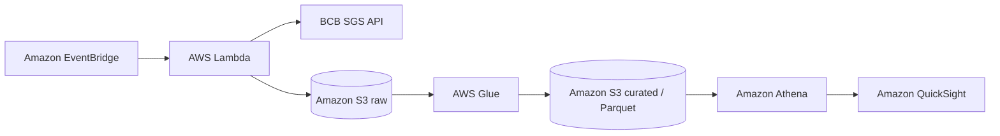

# Architecture

## Data layers

- **Raw:** immutable newline-delimited JSON exactly as normalized by the ingestion function.
- **Curated:** typed Parquet, partitioned by series, year, and month.
- **Analytics:** Athena views that combine monthly indicators and expose dashboard metrics.

## Automation

EventBridge will invoke the Lambda ingestion once per business day. The first cloud iteration will use an on-demand Glue transformation to keep costs predictable. A scheduled transformation can be enabled only after cost measurements are available.

## Data sources

All initial series come from the official Banco Central do Brasil SGS API:

| Series | SGS code | Frequency |
| --- | ---: | --- |
| USD/BRL sell exchange rate | 1 | Daily |
| CDI interest rate | 12 | Daily |
| Accumulated Selic rate in the month | 4390 | Monthly |
| IPCA inflation rate | 433 | Monthly |
