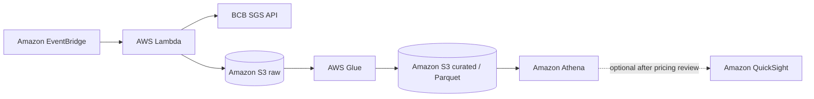

# Architecture

## Data layers

- **Raw:** immutable newline-delimited JSON exactly as normalized by the ingestion function.
- **Curated:** typed Parquet, partitioned by series, year, and month.
- **Analytics:** Athena views that combine monthly indicators and expose dashboard metrics.

## Automation

EventBridge is deployed disabled, then enabled for weekday ingestion only after
an end-to-end validation. Glue stays on demand so a recurring Spark job cannot
silently consume credits. Athena runs inside a dedicated workgroup with a 10 MB
scan cutoff and seven-day result retention. QuickSight remains optional until
its current pricing is reviewed explicitly.

## Data sources

All initial series come from the official Banco Central do Brasil SGS API:

| Series | SGS code | Frequency |
| --- | ---: | --- |
| USD/BRL sell exchange rate | 1 | Daily |
| CDI interest rate | 12 | Daily |
| Accumulated Selic rate in the month | 4390 | Monthly |
| IPCA inflation rate | 433 | Monthly |
